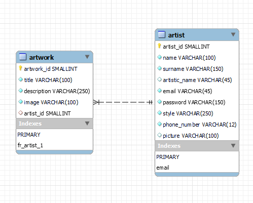

# digiArt
> This is my personal full stack project that I made after 8 weeks in the bootcamp. It was made just by myself and it tooks 3 days to finished it. The project is a kind of exam which the students can probe the knowledge level in the middle of the bootcamp.
> Video demo in YouTube: [_english_](https://youtu.be/x851u6-utEU) [ spanish ](https://youtu.be/kVVbpfFj-yU).

## Table of Contents
* [General Info](#general-information)
* [Technologies Used](#technologies-used)
* [Features](#features)
* [Screenshots](#screenshots)
* [Setup](#setup)
* [Project Status](#project-status)
* [Acknowledgements](#acknowledgements)
* [Contact](#contact)
* [License](#license)

## General Information
- The app is about digital art where the user is able to login, upload pictures, edit and delete them. 
- The information is connected to the database.
- Sometimes the app does not have too much sense because that is not the point. The objective was to make an app which allows to manipulate a database and, of course, without bugs.

## Technologies Used
- Front-end: HTML5 - SASS - Bootstrap - JavaScript
- Back-end: Node.js - Express [  other libraries:  mysql  |  multer  |  bcrypt  |  nodemon  ]
- Database: MySQL

## Features
- Encrypted passwords.
- Full responsive to many screen sizes.
- Functional email form using Formspree API.
- Some unique icons and logotipe.
- Default profile and background picture.

## Screenshots

 
 

 
 

 
 

 
 

## Setup
1- Create the database. You will find it at './public/database/digiArt.sql'.
 
The relational diagram should be like:
    

 
2- Run 'npm instal' in your terminal. It will install all the dependencies from the package.json.
 
3- Lunch the server with nodemon writing 'npm start' in the terminal.
 
4- Go to your browser and type 'localhost:3000'.
 
5- Your are in!

## Acknowledgements
- This project was inspired by [Deviant Art](https://www.deviantart.com/), [Art Station](https://www.artstation.com/?sort_by=community), [Concept Art World](https://conceptartworld.com/) and [CG Society](https://cgsociety.org/).
- This project was based on a project for a bootcamp by [Socratech](https://socratech.es/).
- Many thanks to the professors Carlos Yañez and Miriam Segura.

## Contact
Created by [@flynerdpl](https://www.flynerd.pl/) - feel free to contact me!
